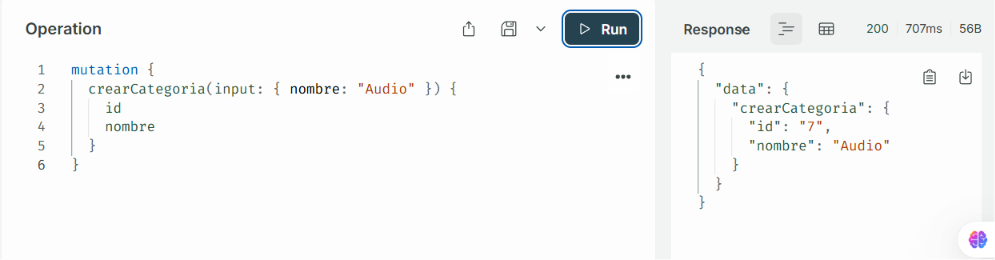
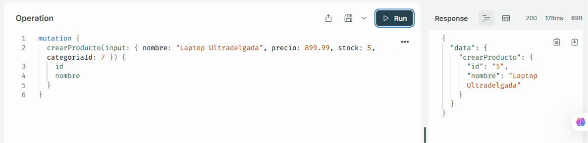
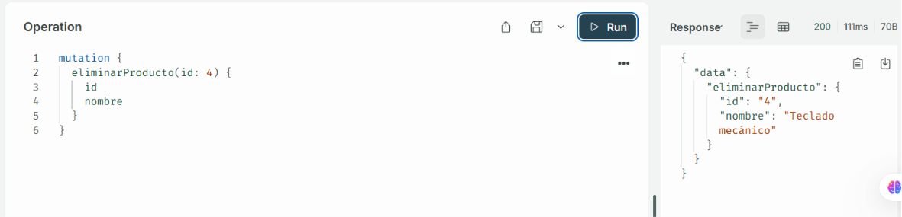

# CRUD GraphQL — Productos y Categorías

Mini proyecto MVC con **Node.js**, **PostgreSQL** y **GraphQL (Apollo Server)**.
Caso de estudio: tienda — gestión de **Productos** y **Categorías**, relacionados entre sí (una categoría tiene muchos productos).

## Tecnologías

- Node.js + Express
- Apollo Server 4 (`@apollo/server`)
- PostgreSQL (`pg`)
- ES Modules (`"type": "module"`)

## Estructura del proyecto

```
crud_graphql/
├── config/
│   └── db.js                  # Conexión a PostgreSQL (pg.Pool)
├── models/
│   ├── categoria.model.js     # Queries SQL de categorías
│   └── producto.model.js      # Queries SQL de productos
├── middlewares/
│   ├── logger.js              # Log de cada request
│   └── errorHandler.js        # Manejo centralizado de errores
├── utils/
│   ├── asyncHandler.js        # Wrapper para controllers async
│   ├── response.js            # Formato de respuesta REST estandarizado
│   └── validators.js          # Validaciones de negocio
├── graphql/
│   ├── schema.js               # Type defs (Query, Mutation, tipos)
│   └── resolvers.js            # Resolvers de Apollo Server
├── controllers/
│   └── health.controller.js   # Health check REST
├── routes/
│   ├── health.routes.js       # GET /health
│   └── graphql.routes.js      # Monta Apollo Server en /graphql
├── server.js
├── package.json
└── .env.example
```

## Requisitos previos

- Node.js instalado
- PostgreSQL instalado y corriendo localmente

## Instalación

1. Clonar el repositorio:
   ```bash
   git clone https://github.com/TU_USUARIO/TU_REPO.git
   cd TU_REPO
   ```

2. Instalar dependencias:
   ```bash
   npm install
   ```

3. Crear el archivo `.env` en la raíz del proyecto (mismo nivel que `package.json`), usando `.env.example` como base:
   ```
   PORT=4000

   DB_HOST=localhost
   DB_PORT=5432
   DB_USER=postgres
   DB_PASSWORD=tu_password
   DB_NAME=crud_graphql
   ```

4. Crear la base de datos en PostgreSQL (las tablas se crean solas al levantar el servidor):
   ```sql
   CREATE DATABASE crud_graphql;
   ```

5. Levantar el servidor:
   ```bash
   npm run dev
   ```

Si todo salió bien, verás en consola:
```
✅ Conexión a PostgreSQL establecida correctamente
Tabla 'categorias' verificada/creada correctamente
Tabla 'productos' verificada/creada correctamente
🚀 Servidor corriendo en http://localhost:4000
🎮 Apollo Sandbox disponible en http://localhost:4000/graphql
🩺 Health check en http://localhost:4000/health
```

## Uso

Abre **http://localhost:4000/graphql** en el navegador para acceder a **Apollo Sandbox**, la interfaz donde se ejecutan las queries y mutations.

## Ejemplos de Queries y Mutations

### Crear una categoría

```graphql
mutation {
  crearCategoria(input: { nombre: "Audio" }) {
    id
    nombre
  }
}
```
<p align="center">
  
</p>

**Crear un producto asociado a una categoría:**
```graphql
mutation {
  crearProducto(input: { nombre: "Laptop Ultradelgada", precio: 899.99, stock: 5, categoriaId: 2 }) {
    id
    nombre
  }
}
```
<p align="center">
  
</p>

**Consultar todos los productos (solo algunos campos, y con su categoría):**
```graphql
query {
  productos {
    nombre
    precio
    categoria {
      nombre
    }
  }
}
```
<p align="center">
  
</p>

**Consultar un producto específico:**
```graphql
query {
  producto(id:4 ) {
    nombre
    stock
  }
}
```
<p align="center">
  
</p>


**Filtrar productos por categoría o por rango de precio:**
```graphql
query {
  productos(categoriaId: 1) {
    nombre
    precio
  }
}
```
<p align="center">
  
</p>


```graphql
query {
  productos(precioMin: 20, precioMax: 100) {
    nombre
    precio
  }
}
```
<p align="center">
  
</p>

**Consultar una categoría con todos sus productos:**
```graphql
query {
  categoria(id: 1) {
    nombre
    productos {
      nombre
      precio
    }
  }
}
```
<p align="center">
  
</p>

**Actualizar / eliminar:**
```graphql
mutation {
  actualizarProducto(id: 5, input: { nombre: "Audífonos Bluetooth Pro", precio: 42, stock: 25, categoriaId: 7 }) {
    id
    nombre
    precio
  }
}
```
<p align="center">
  
</p>


```graphql
mutation {
  eliminarProducto(id: 4) {
    id
    nombre
  }
}
```
<p align="center">
  
</p>


## Validaciones

- `nombre`: obligatorio, entre 2 y 100 caracteres.
- `precio`: obligatorio, numérico, mayor a 0.
- `stock`: obligatorio, entero, no negativo.
- `categoriaId`: obligatorio, debe existir en la tabla `categorias`.
- Al consultar, actualizar o eliminar por `id`, se valida que el registro exista.

## Autor

Proyecto académico — UNEMI.
MELANIE GARCÍA OBREGÓN